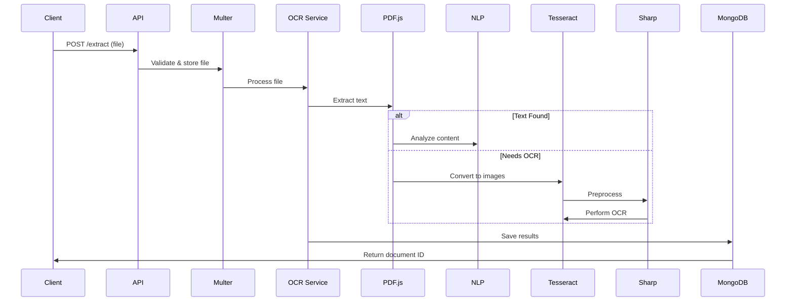

#Case Study: Backend Development Challenge - OCR-BASED Document Processing

# System Architecture 🏗️

## Core Components
1. **Ingestion Layer**
   - Multer file upload handler
   - File validation pipeline
   - Local storage directory management

2. **Processing Engine**
   - PDF.js text extraction
   - Tesseract OCR with image preprocessing
   - NLP entity recognition (Compromise.js)
   - Regex pattern matching

3. **Data Layer**
   - MongoDB document storage
   - Mongoose schema validation

## Processing Workflow

## Security Features 🔒
- File type validation whitelist
- Strict size limits (10MB default)
