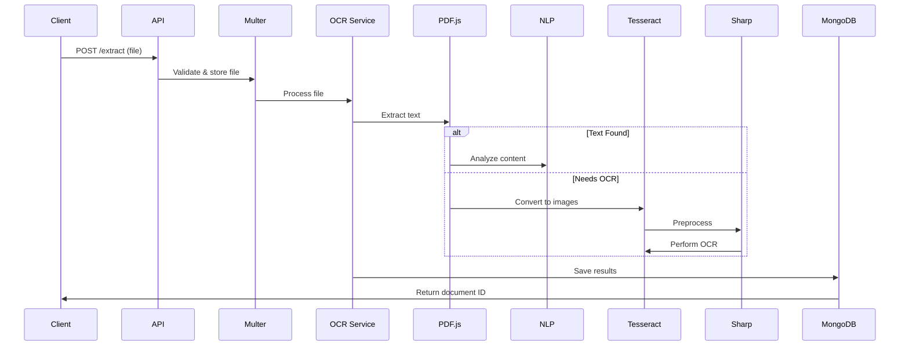

# Case Study: Backend Development Challenge - OCR-BASED Document Processing

## Features ✨
- **Multi-Format Support**: PDF, PNG, JPEG, TIFF
- **Data Enrichment**: NLP entity recognition + regex patterns
- **Preprocessing Pipeline**: Image enhancement for OCR optimization

## Quick Start 🚀

### Prerequisites
- Node.js 18+
- compromise 14.14.4+
- compromise-dates: 3.7.1+
- express 4.21.2+
- mongoose 8.12.1+
- multer 1.4.5-lts.2+
- nodemon 3.1.9+
- pdf2pic 3.1.4+
- pdfjs-dist 5.0.375+
- sharp 0.33.5+
- tesseract.js 6.0.0+

### Installation
```bash
git clone https://github.com/ajiibrahim01/purplebox-ocr.git
cd purplebox-ocr
npm install prerequisites if you need them.
```

### Configuration
```
MONGODB_URI=mongodb://localhost:27017/purplebox_ocr_db
```

### Run Server
```bash
npm run dev  # Development mode
```

## API Endpoints 🌐

| Method | Endpoint          | Description                     |
|--------|-------------------|---------------------------------|
| POST   | `/api/extract`    | Upload document for processing  |
| GET    | `/api/retrieve/:id` | Retrieve processed results    |


## Project Structure 🗂️
```
ocr-api/
├── config/          # Environment config
│   └── connection.js
├── model/           # MongoDB schemas
│   └── ocrSchema.js
├── router/          # API routes
│   └── ocrRoutes.js
├── service/         # Core processing logic
│   ├── utils/       # Helper modules
│   └── ocrService.js
├── storage/         # Uploaded files (auto-created)
├── app.js           # Main application
└── server.js        # Server entry point
```

# System Architecture 🏗️

## Core Components
1. **Ingestion Layer**
   - Multer file upload handler
   - File validation pipeline
   - Local storage directory management

2. **Processing Engine**
   - PDF.js text extraction
   - Tesseract OCR with image preprocessing
   - NLP entity recognition (Compromise.js)
   - Regex pattern matching

3. **Data Layer**
   - MongoDB document storage
   - Mongoose schema validation

## Processing Workflow


## Security Features 🔒
- File type validation whitelist
- Strict size limits (10MB default)


# API Reference v1.0

## Base URL
`http://localhost:3000/api`

## Authentication 🔐
Currently open access

---

## POST /extract
**Process a document**

### Request
```http
POST /extract
Content-Type: multipart/form-data
```

**Body:**
```form-data
file: <document.pdf|image.jpg>
```

### Response
```json
{
  "message": "File processed successfully",
  "filename": "invoice.pdf",
  "retrieveDataId": "650a1b2c3d4e5f6a7b8c9d0e"
}
```

---

## GET /retrieve/{id}
**Fetch processed data**

### Request
```http
GET /retrieve/650a1b2c3d4e5f6a7b8c9d0e
```

### Response
```json
{
  "_id": "650a1b2c3d4e5f6a7b8c9d0e",
  "filename": "invoice.pdf",
  "uploadDate": "2023-09-20T14:30:00.000Z",
  "extractedData": {
    "invoiceNumber": "INV-2023-045",
    "dates": ["2023-09-15"],
    "amounts": {
      "total": "2499.99",
      "tax": "499.99"
    },
    "entities": {
      "organizations": ["Tech Corp Inc"]
    }
  }
}
```

---

## Error Responses 🚨
| Code | Response Body Example                  |
|------|----------------------------------------|
| 400  | `{"error": "Invalid file type"}`       |
| 413  | `{"error": "File exceeds size limit"}` |
| 500  | `{"error": "OCR processing failed"}`   |
